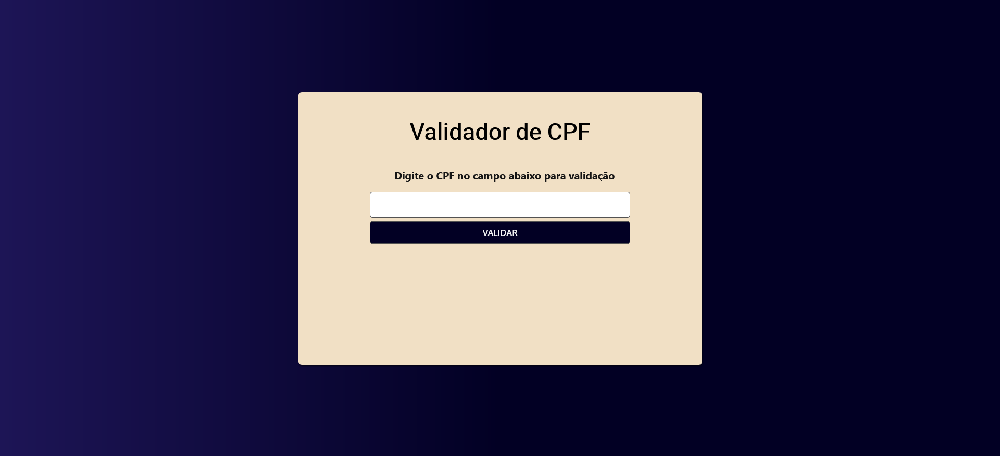

# CPF Validator
[🇺🇸 English](./README.md) | [🇧🇷 Português](./README-pt-BR.md)


A simple and intuitive web application built with HTML, CSS, and JavaScript to validate Brazilian CPF (Cadastro de Pessoas Físicas) numbers.

---

### 📋 Index

- [Project Overview](#-project-overview)
- [Highlights & Features](#-highlights-&-features)
- [Technologies Used](#-technologies-used)
- [Prerequisites](#-prerequisites)
- [Installation](#-installation)
- [How to Use](#-how-to-use)
- [Contribution](#-contribution)
- [License](#-license)
- [Author](#-author)

---

## 🚀 Project Overview

This project provides a clean user interface for users to input a CPF number and instantly check its validity based on the official algorithm for calculating the check digits.





## ✨ Highlights & Features

- **Clear Feedback:** Provides clear visual messages for valid and invalid CPFs.
- **Algorithm Check:** Implements the official mathematical algorithm to verify the two check digits.
- **Responsive Design:** Adapts to different screen sizes for a great experience on desktop and mobile devices.

## 🛠️ Technologies Used

This project was built using the following technologies:


## ⚙️ Prerequisites

All you need is a modern web browser (like Chrome, Firefox, or Edge).

## 📦 Installation

```bash
# 1. Clone this repository
$ git clone https://github.com/emellybmuniz/validador-CPF.git

# 2. Navigate to the project directory
$ cd validador-CPF

# 3. Open in your browser
$ open index.html  # Or double-click the file
```

## 💡 How to Use

1. Open the `index.html` file in your web browser.
2. Enter an 11-digit CPF number in the input field.
3. The application will immediately display a message indicating whether the CPF is valid or invalid.

## 🤝 Contribution

Contributions are always welcome and greatly appreciated! Feel free to open an issue or submit a pull request.

1. Fork the project.
2. Create a new branch (`git checkout -b feature/amazing-feature`).
3. Commit your changes (`git commit -m 'Add amazing feature'`).
4. Push to the branch (`git push origin feature/amazing-feature`).
5. Open a Pull Request.   

## 🔑 License

This project is licensed under the MIT License - see the `LICENSE.md` file for details.

## ✍️ Author

Crafted with ❤️ by **Emelly Beatriz**

📬 Get in touch:
📧 emellybmuniz@gmail.com |
💼 [Linkedin](www.linkedin.com/in/emellybmuniz) |
🐙 [Github](https://github.com/emellybmuniz)

