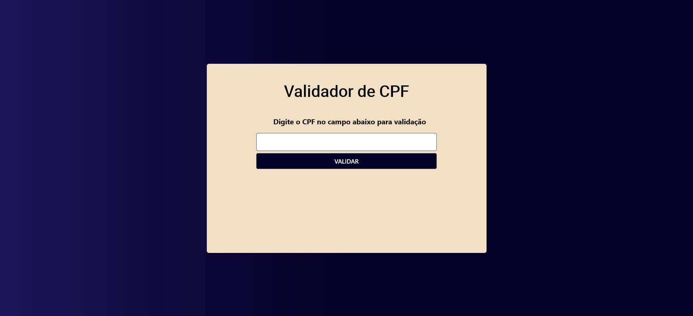

# Validador de CPF
[🇺🇸 English](./README.md) | [🇧🇷 Português](./README.pt.md)


Uma aplicação web simples e intuitiva construída com HTML, CSS e JavaScript para validar números de CPF (Cadastro de Pessoas Físicas).

---

### 📋 Index

- [Visão Geral do Projeto](#-visão-geral-do-projeto)
- [Destaques & Funcionalidades](#-destaques-&-funcionalidades)
- [Tecnologias Utilizadas](#-tecnologias-utilizadas)
- [Pré-requisitos](#-pré-requisitos)
- [Instalação](#-instalação)
- [Como Usar](#-como-usar)
- [Contribuição](#-contribuição)
- [Licença](#-licença)
- [Autora](#-autora)

---

## 🚀 Visão Geral do Projeto

Este projeto oferece uma interface de usuário limpa para que os usuários possam inserir um número de CPF e verificar instantaneamente sua validade com base no algoritmo oficial de cálculo dos dígitos verificadores.




## ✨ Destaques & Funcionalidades

- **Feedback Claro:** Fornece mensagens visuais claras para CPFs válidos e inválidos.
- **Verificação de Algoritmo:** Implementa o algoritmo matemático oficial para verificar os dois dígitos verificadores.
- **Design Responsivo:** Adapta-se a diferentes tamanhos de tela para uma ótima experiência em desktops e dispositivos móveis.

## 🛠️ Tecnologias Utilizadas

Este projeto foi construído usando as seguintes tecnologias:


## ⚙️ Pré-requisitos

Tudo o que você precisa é de um navegador web moderno (como Chrome, Firefox ou Edge).

## 📦 Instalação

```bash
# 1. Clone este repositório
$ git clone https://github.com/emellybmuniz/validador-CPF.git

# 2. Navegue até o diretório do projeto
$ cd validador-CPF

# 3. Abra no seu navegador
$ open index.html  # Ou dê um duplo clique no arquivo
```

## 💡 Como Usar
1. Open the `index.html` file in your web browser.
2. Enter an 11-digit CPF number in the input field.
3. The application will immediately display a message indicating whether the CPF is valid or invalid.

## 🤝 Contribuição

Qualquer contribuição que você fizer será muito apreciada! Sinta-se à vontade para abrir uma *issue* ou enviar um *pull request*. 

1. Faça um *Fork* do projeto.
2. Crie uma nova *branch* (`git checkout -b feature/sua-feature`).
3. Faça o *commit* de suas alterações (`git commit -m 'Adiciona nova feature'`).
4. Faça o *push* para a *branch* (`git push origin feature/sua-feature`).
5. Abra um *Pull Request*.

## 🔑 Licença

Este projeto não está sob nenhuma licença específica. 

## ✍️ Autor

Feito por **Emelly Muniz** com ❤️

📬 Entre em contato:
📧 emellybmuniz@gmail.com |
💼 [Linkedin](www.linkedin.com/in/emellybmuniz) |
🐙 [Github](https://github.com/emellybmuniz)
